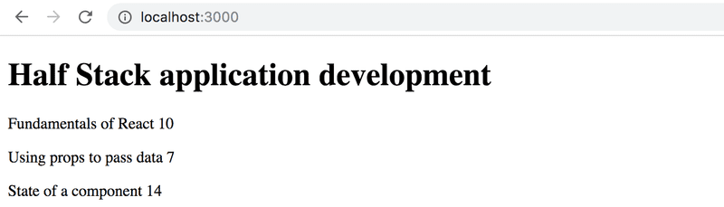

# Full Stack Open --- Part 2

## Course Info App

| Contents                 |
| ------------------------ |
| [Step 6](#exercise-2.1)  |
| [Step 7](#exercise-2.2)  |
| [Step 8](#exercise-2.3)  |
| [Step 9](#exercise-2.4)  |
| [Step 10](#exercise-2.5) |

### Exercise 2.1

#### Course Information, Step 6 [&#8593;](#course-info-app)

Let's finish the code for rendering course contents from exercises 1.1 - 1.5. You can start with the code from the model answers. The model answers for part 1 can be found by going to the submission system, clicking on my submissions at the top, and in the row corresponding to part 1 under the solutions column clicking on show. To see the solution to the course info exercise, click on index.js under kurssitiedot ("kurssitiedot" means "course info").

Note that if you copy a project from one place to another, you might have to delete the node_modules directory and install the dependencies again with the command npm install before you can start the application.

Generally, it's not recommended that you copy a project's whole contents and/or add the node_modules directory to the version control system.

Let's change the App component like so:

```react
const App = () => {
  const course = {
    id: 1,
    name: 'Half Stack application development',
    parts: [
      {
        name: 'Fundamentals of React',
        exercises: 10,
        id: 1
      },
      {
        name: 'Using props to pass data',
        exercises: 7,
        id: 2
      },
      {
        name: 'State of a component',
        exercises: 14,
        id: 3
      }
    ]
  }

  return <Course course={course} />
}

export default App
```

Hence, the Course component contains the components defined in the previous part, which are responsible for rendering the course name and its parts.

The rendered page can, for example, look as follows:



You don't need the sum of the exercises yet.

The application must work _regardless of the number of parts a course has_, so make sure the application works if you add or remove parts of a course.

Ensure that the console shows no errors!

### Exercise 2.2

#### Course Information, Step 7 [&#8593;](#course-info-app)

Show also the sum of the exercises of the course:


### Exercise 2.3

#### Course Information, Step 8 [&#8593;](#course-info-app)

If you haven't done so already, calculate the sum of exercises with the array method reduce.
