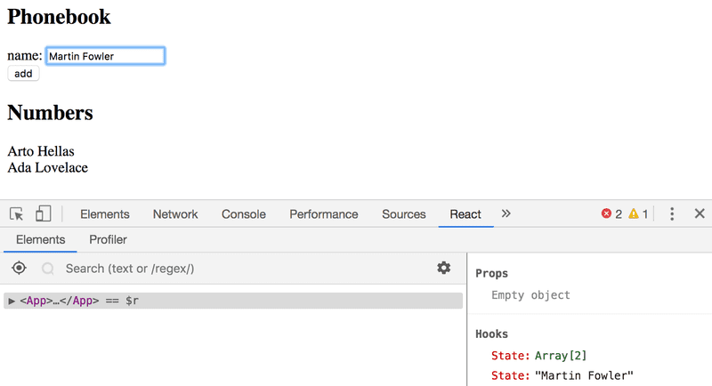
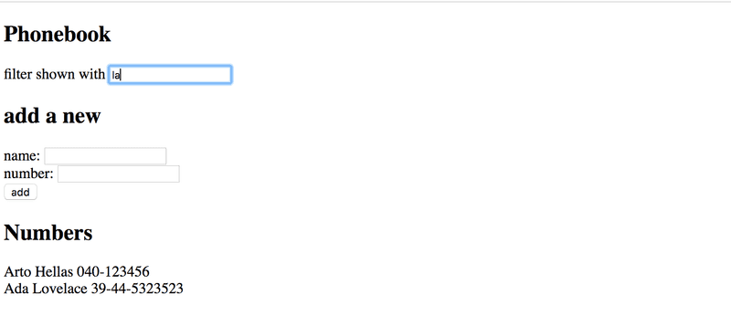

# Full Stack Open --- Part 2

## Phonebook App

| Contents                  |
| ------------------------- |
| [Step 1](#exercise-2.6)   |
| [Step 2](#exercise-2.7)   |
| [Step 3](#exercise-2.8)   |
| [Step 4](#exercise-2.9)   |
| [Step 5 ](#exercise-2.10) |

### Exercise 2.6

#### Phonebook, Step 1 [&#8593;](#phonebook-app)

Let's create a simple phonebook. In this part, we will only be adding names to the phonebook.

Let us start by implementing the addition of a person to the phonebook.

You can use the code below as a starting point for the App component of your application:

```react
import { useState } from 'react'

const App = () => {
  const [persons, setPersons] = useState([
    { name: 'Arto Hellas' }
  ])
  const [newName, setNewName] = useState('')

  return (
    <div>
      <h2>Phonebook</h2>
      <form>
        <div>
          name: <input />
        </div>
        <div>
          <button type="submit">add</button>
        </div>
      </form>
      <h2>Numbers</h2>
      ...
    </div>
  )
}

export default App
```

The newName state is meant for controlling the form input element.

Sometimes it can be useful to render state and other variables as text for debugging purposes. You can temporarily add the following element to the rendered component:

```react
<div>debug: {newName}</div>
```

After finishing this exercise your application should look something like this:


NB:

- you can use the person's name as a value of the key property
- remember to prevent the default action of submitting HTML forms!

### Exercise 2.7

#### Phonebook, Step 2 [&#8593;](#phonebook-app)

Prevent the user from being able to add names that already exist in the phonebook. JavaScript arrays have numerous suitable methods for accomplishing this task. Keep in mind how object equality works in Javascript.

Issue a warning with the alert command when such an action is attempted:


### Exercise 2.8

#### Phonebook, Step 3 [&#8593;](#phonebook-app)

Expand your application by allowing users to add phone numbers to the phone book. You will need to add a second input element to the form (along with its own event handler):

```react
<form>
  <div>name: <input /></div>
  <div>number: <input /></div>
  <div><button type="submit">add</button></div>
</form>
```

At this point, the application could look something like this. The image also displays the application's state with the help of React developer tools:


### Exercise 2.9

#### Phonebook, Step 4 [&#8593;](#phonebook-app)

Implement a search field that can be used to filter the list of people by name:



You can implement the search field as an input element that is placed outside the HTML form. The filtering logic shown in the image is case insensitive, meaning that the search term _arto_ also returns results that contain Arto with an uppercase A.
