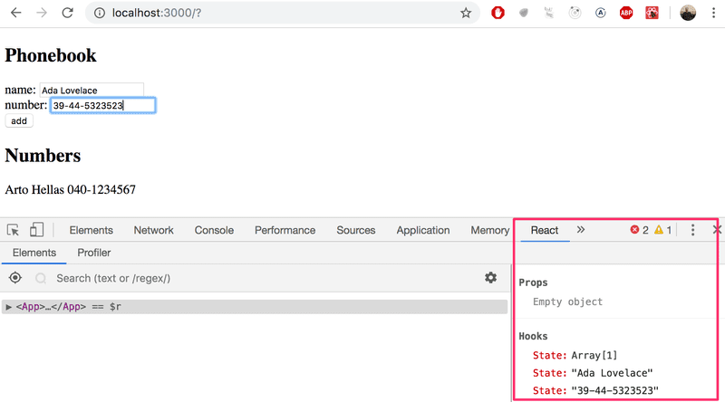

# Full Stack Open --- Part 2

## Phonebook App

| Contents                  |
| ------------------------- |
| [Step 1](#exercise-2.6)   |
| [Step 2](#exercise-2.7)   |
| [Step 3](#exercise-2.8)   |
| [Step 4](#exercise-2.9)   |
| [Step 5](#exercise-2.10)  |
| [Step 6](#exercise-2.11)  |
| [Step 7](#exercise-2.12)  |
| [Step 8](#exercise-2.13)  |
| [Step 9](#exercise-2.14)  |
| [Step 10](#exercise-2.15) |

### Exercise 2.6

#### Phonebook, Step 1 [&#8593;](#phonebook-app)

Let's create a simple phonebook. In this part, we will only be adding names to the phonebook.

Let us start by implementing the addition of a person to the phonebook.

You can use the code below as a starting point for the App component of your application:

```react
import { useState } from 'react'

const App = () => {
  const [persons, setPersons] = useState([
    { name: 'Arto Hellas' }
  ])
  const [newName, setNewName] = useState('')

  return (
    <div>
      <h2>Phonebook</h2>
      <form>
        <div>
          name: <input />
        </div>
        <div>
          <button type="submit">add</button>
        </div>
      </form>
      <h2>Numbers</h2>
      ...
    </div>
  )
}

export default App
```

The newName state is meant for controlling the form input element.

Sometimes it can be useful to render state and other variables as text for debugging purposes. You can temporarily add the following element to the rendered component:

```react
<div>debug: {newName}</div>
```

After finishing this exercise your application should look something like this:


NB:

- you can use the person's name as a value of the key property
- remember to prevent the default action of submitting HTML forms!

### Exercise 2.7

#### Phonebook, Step 2 [&#8593;](#phonebook-app)

Prevent the user from being able to add names that already exist in the phonebook. JavaScript arrays have numerous suitable methods for accomplishing this task. Keep in mind how object equality works in Javascript.

Issue a warning with the alert command when such an action is attempted:


### Exercise 2.8

#### Phonebook, Step 3 [&#8593;](#phonebook-app)

Expand your application by allowing users to add phone numbers to the phone book. You will need to add a second input element to the form (along with its own event handler):

```react
<form>
  <div>name: <input /></div>
  <div>number: <input /></div>
  <div><button type="submit">add</button></div>
</form>
```

At this point, the application could look something like this. The image also displays the application's state with the help of React developer tools:



### Exercise 2.9

#### Phonebook, Step 4 [&#8593;](#phonebook-app)

Implement a search field that can be used to filter the list of people by name:


You can implement the search field as an input element that is placed outside the HTML form. The filtering logic shown in the image is case insensitive, meaning that the search term _arto_ also returns results that contain Arto with an uppercase A.

### Exercise 2.10

#### Phonebook, Step 5 [&#8593;](#phonebook-app)

If you have implemented your application in a single component, refactor it by extracting suitable parts into new components. Maintain the application's state and all event handlers in the App root component.

It is sufficient to extract three components from the application. Good candidates for separate components are, for example, the search filter, the form for adding new people to the phonebook, a component that renders all people from the phonebook, and a component that renders a single person's details.

The application's root component could look similar to this after the refactoring. The refactored root component below only renders titles and lets the extracted components take care of the rest.

```react
const App = () => {
  // ...

  return (
    <div>
      <h2>Phonebook</h2>

      <Filter ... />

      <h3>Add a new</h3>

      <PersonForm
        ...
      />

      <h3>Numbers</h3>

      <Persons ... />
    </div>
  )
}
```

### Exercise 2.11

#### Phonebook, Step 6 [&#8593;](#phonebook-app)

We continue with developing the phonebook. Store the initial state of the application in the file db.json, which should be placed in the root of the project.

```json
{
  "persons": [
    {
      "name": "Arto Hellas",
      "number": "040-123456",
      "id": "1"
    },
    {
      "name": "Ada Lovelace",
      "number": "39-44-5323523",
      "id": "2"
    },
    {
      "name": "Dan Abramov",
      "number": "12-43-234345",
      "id": "3"
    },
    {
      "name": "Mary Poppendieck",
      "number": "39-23-6423122",
      "id": "4"
    }
  ]
}
```

Start json-server on port 3001 and make sure that the server returns the list of people by going to the address http://localhost:3001/persons in the browser.

If you receive the following error message:

```
events.js:182
      throw er; // Unhandled 'error' event
      ^

Error: listen EADDRINUSE 0.0.0.0:3001
    at Object._errnoException (util.js:1019:11)
    at _exceptionWithHostPort (util.js:1041:20)
```

it means that port 3001 is already in use by another application, e.g. in use by an already running json-server. Close the other application, or change the port in case that doesn't work.

Modify the application such that the initial state of the data is fetched from the server using the axios-library. Complete the fetching with an Effect hook.

### Exercise 2.12

#### Phonebook, Step 7 [&#8593;](#phonebook-app)

Let's return to our phonebook application.

Currently, the numbers that are added to the phonebook are not saved to a backend server. Fix this situation.

### Exercise 2.13

#### Phonebook, Step 8 [&#8593;](#phonebook-app)

Extract the code that handles the communication with the backend into its own module by following the example shown earlier in this part of the course material.
